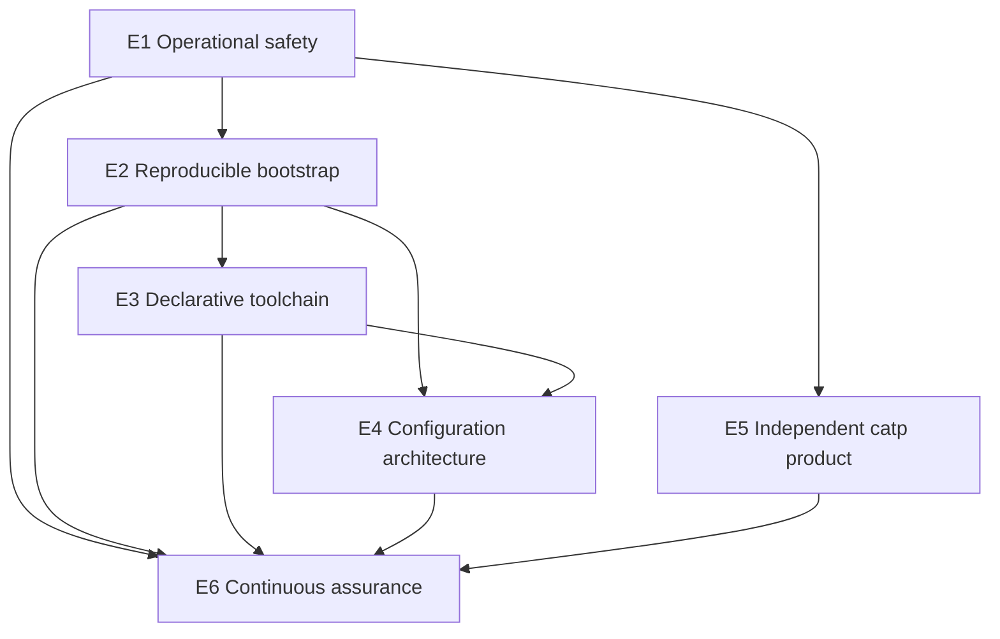

# Dotfiles & Tooling Modernization Roadmap

**Status:** Active

**Governing invariant:** `Ethos/Purpose`

**Last audited:** 2026-08-04

This roadmap groups modernization into epics with measurable outcomes. It distinguishes verified current behavior from intended architecture. An epic is complete only when its acceptance criteria have been exercised.

## Portfolio objective

Evolve the repository from a host-coupled personal environment into a system that is:

- **safe by default** for routine operations;
- **reproducible** from committed state;
- **clear about ownership** between configuration, bootstrap, tools, and generated projections;
- **modular** across personal, work, WSL, and optional concerns;
- **independently testable**, especially for `catp` and installation.

## Verified baseline

The repository currently works for the owner's Linux/WSL environment and contains five overlapping domains:

| Domain | Current implementation | Main gap |
| --- | --- | --- |
| Configuration | Dotbot links shell, Git, SSH, GPG, Byobu, Starship, Cursor, and helpers | Personal, work, WSL, and optional concerns are interleaved |
| Bootstrap | `install` generates `install.conf.yaml`, initializes dependencies, removes selected files, and runs Dotbot | Destructive without backup; dependency state is not reproducible |
| Tooling | `tools/catp/` and personal scripts under `bin/` | `catp` is not independently packaged; helper safety contracts vary |
| Editor profiles | Cursor multi-profile scripts and VS Code recommendations | Linux/owner paths and Cursor internals are coupled to implementation |
| Governance | `.agents/imports.json` plus generated projections | Materialization depends on an external, machine-specific checkout |

Known high-consequence behavior includes:

- SSH host configuration that can pull and execute dotfiles installation during connection setup;
- `bin/repo-sync.py` mutating repositories while constructing its apparent plan;
- `ssh_sync` mirroring SSH material with deletion and symlink following;
- a privileged, non-TLS Docker daemon helper linked by the installer;
- bootstrap deletion of unmanaged files without backups;
- submodules advanced to remote branch heads during installation;
- conflicting root and `catp` license declarations.

## Epic overview

| Epic | Outcome | Status | Depends on |
| --- | --- | --- | --- |
| E1. Operational safety | Routine commands have explicit, non-destructive safety contracts | In progress | — |
| E2. Reproducible bootstrap | Installation is reviewable, reversible, and idempotent | Planned | E1 safety decisions |
| E3. Declarative toolchain | Runtime and package ownership is declared once | Planned | E2 ownership boundaries |
| E4. Configuration architecture | Portable, personal, work, WSL, and optional concerns are separated | Planned | E2, E3 |
| E5. Independent `catp` product | `catp` builds, installs, tests, and evolves independently | In progress | E1 license decision |
| E6. Continuous assurance | CI detects drift, unsafe regressions, and broken installation | Planned, incremental | Lands throughout E1–E5 |

## Delivery sequence

E5 can proceed in parallel with E2–E4 once licensing is resolved. E6 is not a final cleanup phase: each epic should add the checks needed to preserve its own outcome.

---

## E1. Operational safety

**Outcome:** High-consequence actions are explicit, reviewable, and safe by default.

**Primary invariants:** `Praxis/Justice`, `Logos/Prudence`, `Logos/Clarity`.

### E1.1 Truthful contracts — In progress

- [x] Audit root documentation, bootstrap, shell/editor configuration, submodules, scripts, and `catp`.
- [x] Document current support boundaries, generated files, bootstrap side effects, and `catp` packaging status.
- [x] Replace stale roadmap completion claims with evidence-based epics and gates.
- [ ] Inventory retained `bin/` helpers by purpose, platform, mutation level, and support status.
- [ ] Classify tracked `.env.*` files as safe configuration/templates or remove them from version control.

### E1.2 Repository operation safety — Planned

- [ ] Quarantine `bin/repo-sync.py` from routine aliases until planning is read-only.
- [ ] Correct branch-change detection.
- [ ] Add clean-tree, protected-branch, branch-selection, and remote-identity checks.
- [ ] Replace force pushes with explicit `--force-with-lease` execution after confirmation.

### E1.3 SSH and credential safety — Planned

- [ ] Remove automatic `git pull && ./install` execution from SSH `LocalCommand` hooks.
- [ ] Replace it with an explicit update command or pinned configuration-management workflow.
- [ ] Replace whole-directory `ssh_sync` behavior with an allowlisted, non-destructive model.
- [ ] Do not sync private keys by default; document the intended agent/hardware-backed identity model.
- [ ] Review passphraseless identities and duplicate/order-dependent SSH host definitions.

### E1.4 Privileged helper retirement — Planned

- [ ] Remove `bin/dockerd-start` and `bin/dockerd-rm` from Dotbot links.
- [ ] Delete or archive the helpers unless a loopback-only authenticated replacement is required.
- [ ] Review `clean-routes.sh`, `fabric.sh`, `lang.py`, and similar mutation-capable helpers before retaining them.

### E1.5 License and secret posture — Decision required

- [ ] Decide whether `catp` inherits the root CCxL license or receives a separate license.
- [ ] Align `LICENSE`, package metadata, classifiers, artifact contents, and documentation.
- [ ] Add targeted secret scanning for tracked configuration and future changes.

### Acceptance criteria

1. Opening an SSH session cannot update or execute repository code implicitly.
2. A command described as a preview performs no mutation.
3. No default-installed helper exposes an unauthenticated privileged service.
4. SSH synchronization cannot delete destination-only credentials or follow arbitrary key symlinks.
5. License claims are internally consistent.

---

## E2. Reproducible bootstrap

**Outcome:** Bootstrap converges a host from committed state with preview, recovery, and repeatability.

**Primary invariants:** `Logos/Prudence`, `Logos/Elenchus`, `Praxis/Wisdom`.

### E2.1 Deterministic inputs — In progress

- [x] Resolve `BASEDIR` before reading `.env`, profile, Git config, or template files.
- [x] Replace `export $(grep ... | xargs)` with explicit profile sourcing; default to the required `home` profile and reject missing profile files.
- [ ] Validate required commands, files, variables, and platform before mutation.
- [x] Keep `install.conf.template.yaml` authoritative and `install.conf.yaml` generated.

### E2.2 Preview and recovery — Planned

- [ ] Add `./install --check` or equivalent dry-run output.
- [ ] Show links, removals, package actions, and generated-file changes before execution.
- [ ] Back up unmanaged files or require explicit confirmation before replacement.
- [ ] Preserve a recovery manifest for modified paths.

### E2.3 Reproducible dependencies — Planned

- [ ] Remove `--remote` from normal submodule installation and consume committed gitlinks.
- [ ] Move submodule advancement into a separate explicit maintenance workflow.
- [x] Eliminate duplicate Starship installation ownership; `install` owns installation and Starship uses its built-in default prompt.
- [ ] Replace unpinned `curl | sh` provisioning with versioned, integrity-checked inputs.
- [ ] Decide whether `complete-alias` remains a submodule or is replaced by native completion.

### E2.4 Platform contract — Planned

- [ ] Define supported Ubuntu/Linux and WSL versions.
- [ ] Repair and explicitly scope `win-install` to WSL, or retire it.
- [ ] Make unsupported macOS and native Windows paths unambiguous.
- [ ] Generate user-specific desktop entries rather than embedding `/home/paul`.

### E2.5 Idempotency evidence — Planned

- [ ] Test fresh-home installation in a disposable environment.
- [ ] Test repeat installation with no unexpected changes.
- [ ] Test default and explicit profile selection, including missing-profile rejection.
- [ ] Verify bootstrap does not advance dependency revisions.

### Acceptance criteria

1. `./install --check` reports intended changes without mutating the host.
2. Existing unmanaged configuration is recoverable or replacement requires explicit confirmation.
3. The same repository revision installs the same dependency revisions.
4. Installation can be launched from outside the repository directory.
5. Repeat-run tests demonstrate idempotency.

---

## E3. Declarative toolchain

**Outcome:** Required runtimes and managed CLI tools have one reviewable source of truth.

**Primary invariants:** `Ethos/Legitimacy`, `Logos/Vigor`.

### E3.1 Ownership decision — Planned

- [ ] Select `mise.toml` or a deliberately evaluated equivalent.
- [ ] Classify each current integration as required, optional, work-specific, host-specific, or unmanaged.
- [ ] Decide ownership for Python, Node, Go, FZF, Starship, Bun, pnpm, Rust, and other active runtime paths.
- [ ] Decide which existing submodules remain justified.

### E3.2 Declarative implementation — Planned

- [ ] Declare supported runtime and CLI versions once.
- [ ] Refactor Dotbot actions to link configuration and delegate package/runtime convergence.
- [ ] Remove duplicate installation paths and superseded imperative helpers.
- [ ] Document update cadence, pinning policy, and rollback behavior.

### E3.3 Shell integration — Planned

- [ ] Let the selected manager own runtime activation where practical.
- [ ] Remove repeated and conflicting PATH mutations.
- [ ] Guard optional tools when they are absent.
- [ ] Keep work-specific package hosts and environment variables out of the base shell.

### Acceptance criteria

1. Managed runtime and tool versions are declared once.
2. Every installed tool has one owning layer.
3. Dependency upgrades are represented by reviewable declaration changes.
4. A minimal interactive shell starts cleanly without optional integrations.

---

## E4. Configuration architecture

**Outcome:** Configuration is modular by identity and explicit about tracked, generated, external, and upstream state.

**Primary invariants:** `Ethos/Identity`, `Praxis/Symbiosis`.

### E4.1 Shell modules — Planned

- [ ] Split shell startup into common path, interactive, WSL, work, and optional-tool modules.
- [ ] Guard FZF, Starship, direnv, GPG TTY setup, and completion loading.
- [ ] Remove avoidable owner-specific absolute paths.
- [ ] Keep private Git hosts and work-only variables in explicit profiles.

### E4.2 Git, SSH, and GPG profiles — Planned

- [ ] Separate broadly reusable defaults from personal identity and signing configuration.
- [ ] Document the 1Password SSH-agent dependency and fallback behavior.
- [ ] Remove duplicate SSH host definitions and fragile include-order assumptions.
- [ ] Review manually pinned cipher and GPG pinentry policy.

### E4.3 Editor profiles — Planned

- [ ] Generate the Cursor desktop entry using the active home directory.
- [ ] Validate required commands and JSON before changing the personal profile.
- [ ] Make settings updates atomic.
- [ ] Replace or document version-sensitive Cursor internal-state links.
- [ ] Harden OAuth callback routing against stale and concurrent requests.

### E4.4 Governance and generated state — Planned

- [ ] Document tracked source-of-truth files versus generated projections.
- [ ] Define the external governance checkout contract and regeneration command.
- [ ] Decide whether mutable `.cursor/hooks/state` belongs in version control.
- [ ] State supported agent/editor consumers, including absent configurations.

### E4.5 Legacy helper disposition — Planned

- [ ] Retire, archive, or document `contextify.sh`, `lang.py`, `fabric.sh`, `winhost.sh`, and `OpenRelayProjects.ps1`.
- [ ] Give retained helpers a usage, platform, dependency, and mutation contract.

### Acceptance criteria

1. Portable base configuration contains no avoidable owner-specific absolute path or work-only state.
2. Personal, work, and WSL behavior is opt-in through named modules or profiles.
3. Optional tools can be absent without shell startup errors.
4. Tracked, generated, external-governance, and submodule boundaries are documented and testable.

---

## E5. Independent `catp` product

**Outcome:** `catp` is an independently buildable, installable, tested tool with project-local policy.

**Primary invariants:** `Ethos/Identity`, `Ethos/Aisthesis`, `Praxis/Symbiosis`.

**Execution plan:** [`tools/catp/ROADMAP.md`](tools/catp/ROADMAP.md)

The root roadmap owns portfolio dependencies and cross-repository decisions. The component roadmap is the source of truth for `catp` milestones, task status, behavioral scope, and product acceptance evidence.

### Portfolio gates

- [ ] E1.5 resolves the authoritative `catp` license.
- [ ] Package artifacts install and expose both public entry points without repository path injection.
- [ ] One supported distribution channel replaces the legacy implementation and launcher.
- [ ] CLI, Git collection, filtering, notebook, and clipboard contracts are tested.
- [ ] Project-local configuration externalizes policy without source edits.
- [ ] E6 verifies package builds, installation, compatibility, and documentation freshness.

### Acceptance criteria

1. A user can install and run `catp` without cloning the dotfiles repository.
2. Metadata, documentation, Python support, distribution channel, and license agree.
3. Projects can customize snapshot policy through a documented and tested configuration contract.
4. Component milestones and evidence are current in `tools/catp/ROADMAP.md`.

---

## E6. Continuous assurance

**Outcome:** Automated evidence prevents documentation, packaging, bootstrap, and security drift.

**Primary invariants:** `Logos/Elenchus`, `Praxis/Wisdom`.

### E6.1 Baseline checks — Planned

- [ ] Run `bash -n` and ShellCheck for owned shell scripts.
- [ ] Run Ruff and pytest for `catp`.
- [ ] Parse generated Dotbot YAML and representative SSH configuration.
- [ ] Check broken links and missing files referenced by documentation or metadata.
- [ ] Verify generated `install.conf.yaml` and `.bash_completion` remain untracked.

### E6.2 Product and installer checks — Planned

- [ ] Build and install `catp` artifacts in isolation.
- [ ] Exercise installer dry-run, fresh-home, repeat-run, and profile scenarios.
- [ ] Assert normal bootstrap does not advance submodules.
- [ ] Test shell startup with optional tools absent.

### E6.3 Security and freshness checks — Planned

- [ ] Scan tracked changes for secrets.
- [ ] Detect privileged network listeners and unsafe force-operation regressions in retained helpers.
- [ ] Check CLI documentation against parser output.
- [ ] Review dependency and submodule updates as explicit maintenance changes.

### Acceptance criteria

1. Every completed epic has CI checks covering its critical contract.
2. Packaging, installation, shell startup, and generated configuration have executable smoke tests.
3. Documentation drift and secret exposure are checked before merge.

## Next executable tranche

The first implementation tranche should remain intentionally small and safety-led:

1. Remove SSH-triggered `git pull && ./install` hooks.
2. Unlink and retire the privileged Docker helpers.
3. Quarantine and repair `bin/repo-sync.py` planning semantics.
4. Decide `catp` licensing.
5. Stop bootstrap from advancing submodules with `--remote`.
6. Add the first CI checks for shell syntax, secrets, and `catp` tests.

This tranche unlocks safe work on the bootstrap and `catp` package boundary without expanding the existing risk surface.
